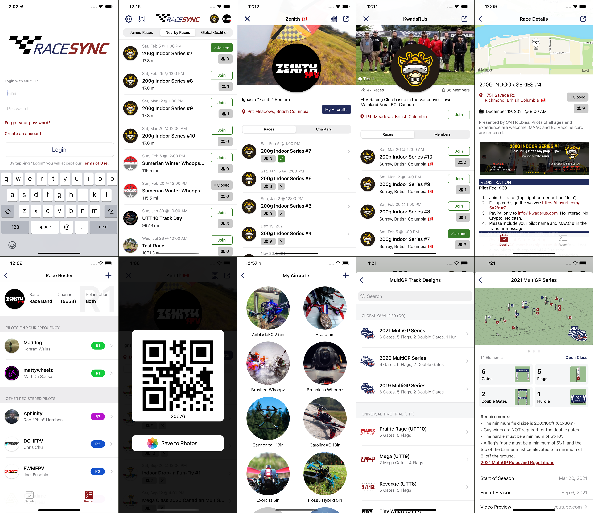

## Available on the App Store
https://apps.apple.com/us/developer/multigp-inc/id1491110679

## RaceSync for iOS & WatchOS
RaceSync is the official app of the MultiGP Drone Racing League. It allows users to find and participate in local drone races held by MultiGP chapters worldwide.

Log in with your free MultiGP account today to access the following features:

As a racer:
• Find local drone races nearby
• Instantly join races and access their information
• Check the video frequency assigned to you during the race
• See who joined the races
• Add race details to your calendar
• Get driving directions to the race venue
• Add or edit aircrafts from your profile
• Conveniently use your MultiGP QR code for special events

As a chapter Organizer:
• Open/Close a race
• Add/Remove pilots to a race
• Access the official MultiGP track designs (GQ, UTT, Champs and more)
• Submit track measurement validation for GQ

## Contributors
Designed and developed by [Ignacio Romero](https://github.com/dzenbot)
