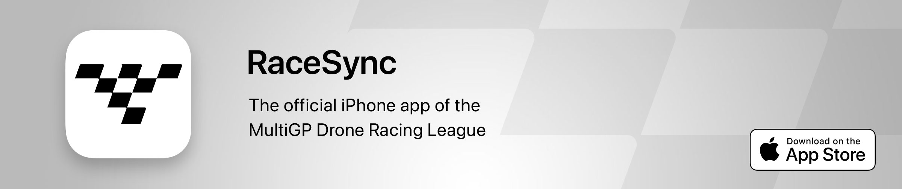
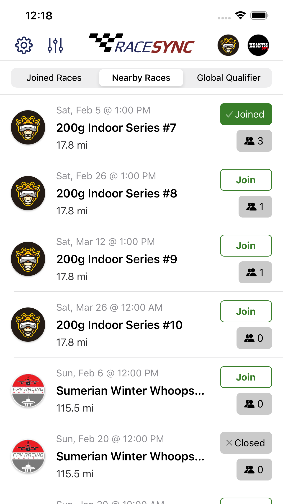
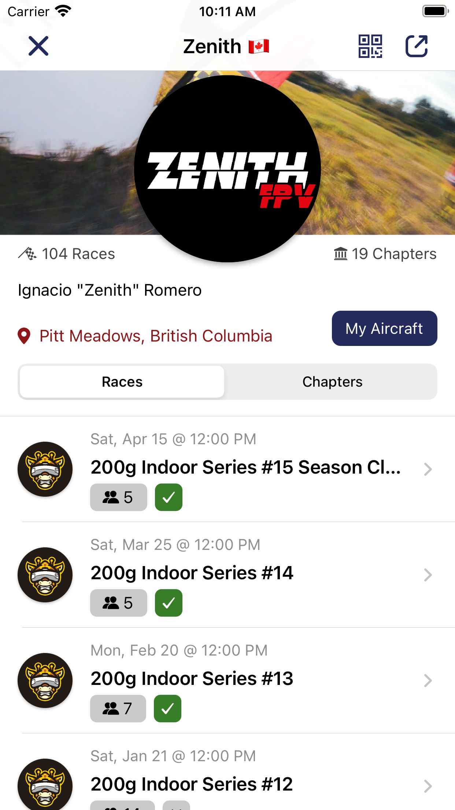
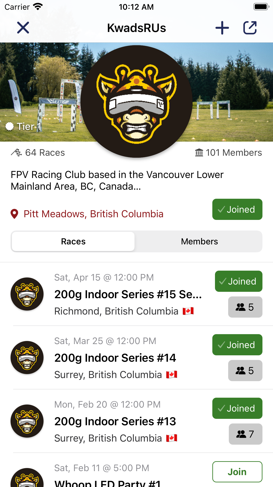
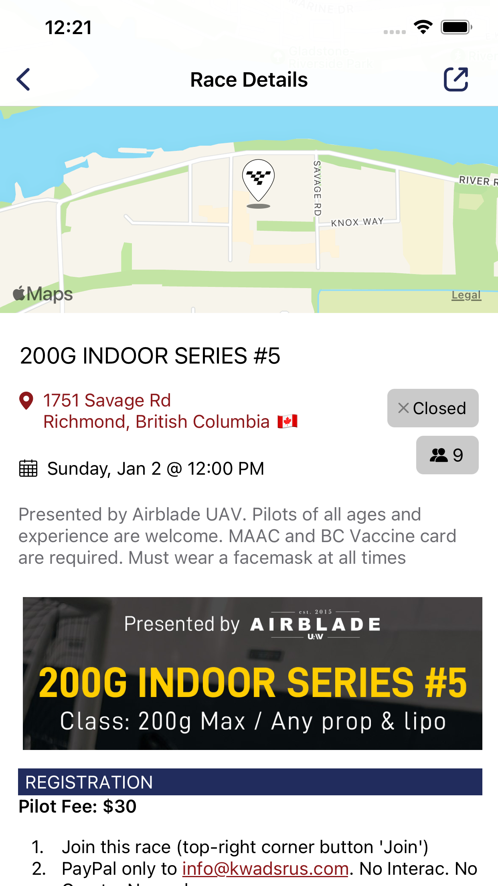
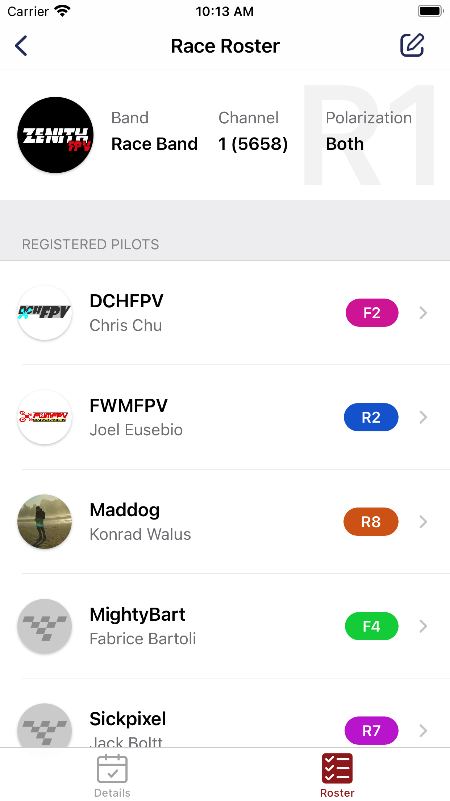
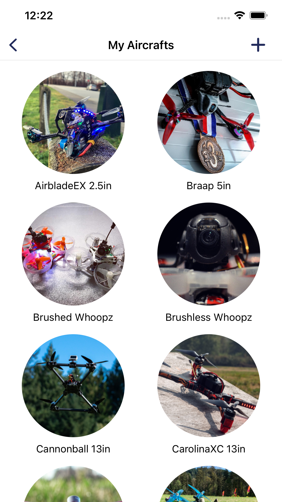
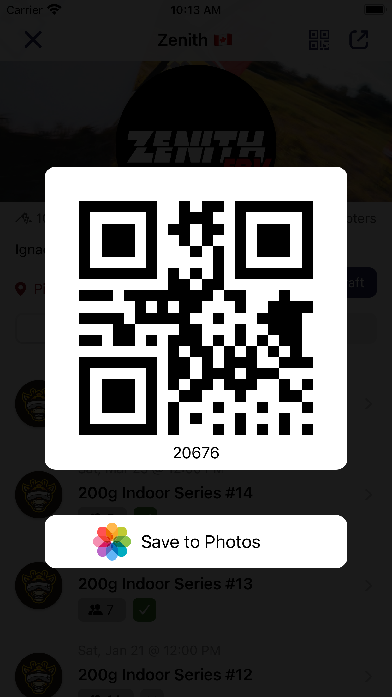
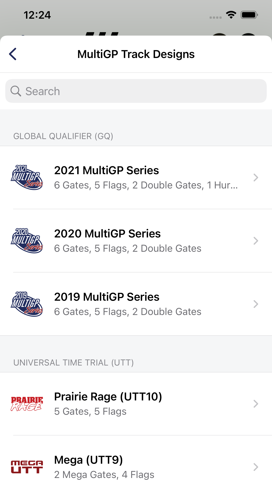

## 

## Screenshots

<table bgcolor=green>
  <tr>
    <th></th>
    <th></th>
    <th></th>
    <th></th>
  </tr>
  <tr>
    <th></th>
    <th></th>
    <th></th>
    <th></th>
  </tr>
</table>

## RaceSync for iOS & WatchOS
Get ready to race with RaceSync, the official app of the MultiGP Drone Racing League.
Find and join local drone races hosted by MultiGP chapters worldwide with a free account.

### Features for racers:
* Discover local races and chapters
* Join races easily and view race information
* Check assigned video frequency during races
* View race participants
* Add races to your calendar and get directions to the venue
* Manage aircraft from your profile
* Use MultiGP QR code for special events and ZippyQ races

### Features for chapter organizers:
* Create, duplicate, and edit races
* Manage pilot participation in races
* Access official MultiGP track designs (GQ, UTT, Champs, and more)
* Submit GQ track measurement validation

Start racing now with RaceSync!
